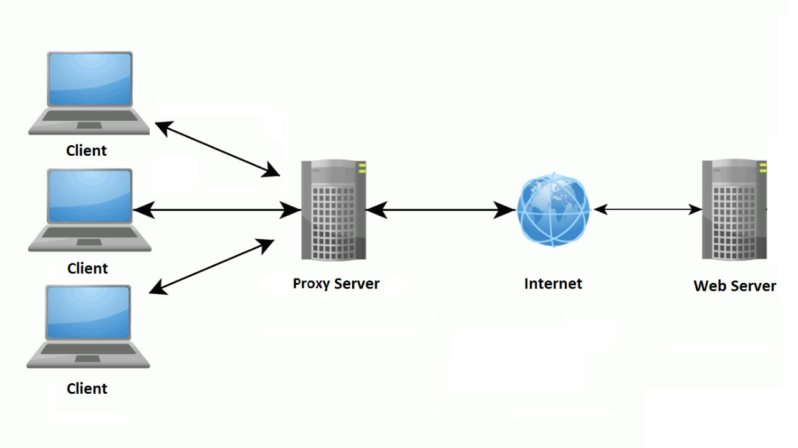
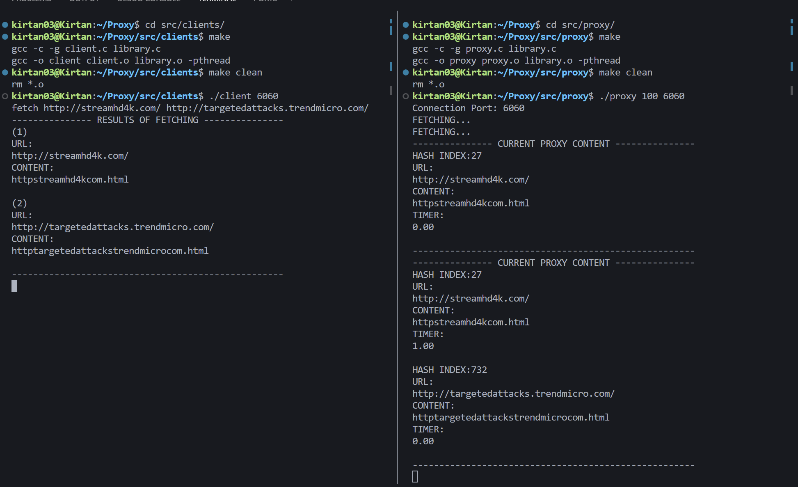

## Proxy Application using Sockets in C

### What does it do?
The purpose of this project is to present an implementation for unix-based systems of a proxy server that serves a set of clients (concurrently) on the same machine through parallel programming techniques. The proxy server makes **HTTP** requests to websites over the internet and returns their contents to the clients. The proxy uses a **hash-based cache** to store the contents and have access efficiently.

### Architecture
<p align="center" width="100%">
        
</p>

### Application
<p align="center" width="100%">
        
</p>


### How to run?
- Compile 
    
    - Within the **src/clients** directory, run: 
        ```bash
        $ make
        $ make clean        
        ```
    - Within the **src/proxy** directory, run: 
        ```bash
        $ make
        $ make clean         
        ```
- Execute
    - Within the **src/proxy** directory, run: 
        ```bash    
        $ ./proxy TIMER_LIMIT PROXY_PORT
         ```
        - Where:
            - TMER_LIMIT - Time (in seconds) the data will be stored in the proxy cache
            - PROXY_PORT - Server Port
    
    - Within the **src/clients** directory, run: 
        ```bash    
        $ ./client PROXY_PORT
         ```

> **NOTE**
>
> You can run multiple clients on the same proxy server. For that, make sure the proxy is running and open different terminals to each client and connect them to the server.

### How to use?
- The Data
    - The clients data (.html files) are stored inside **src/clients/data**.
    - The proxy data (.html files) are stored inside **src/proxy/data**.

- Commands 

    In the client CLI you can run the four commands listed below:

    - **fetch**
        - Used to request a website for the proxy. You can pass multiple URLs, separated by spaces, for example:
            ```C
            $ fetch http://www.test.com http://www.test2.com
            ```
            
        
    - **list**
        - Lists the current proxy content. Remember that after the *TIME_LIMIT* set up earlier, all proxy content is erased.
            ```C
            $ list
            ```

    - **history**
        - Shows the history of commands that were run.
            ```C
            $ history
            ```
    - **Quit**
        - Bye :) !
            ```C
            $ quit
            ```

> **NOTE**
>
> In the **src/test_urls.txt** some URLs are provided to test the application.